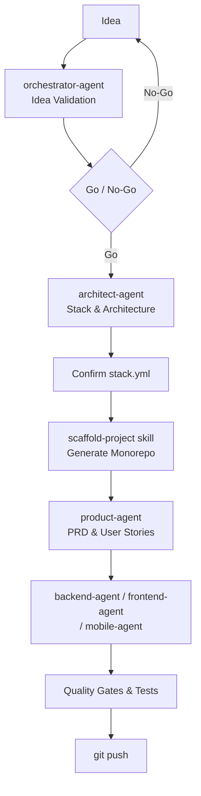

# AI Agentic — VS Code Copilot Agent Workflow Template

A reusable, **tech-stack agnostic** AI agent framework for VS Code Copilot. Covers the full software development lifecycle — from idea validation and architecture design to code generation, testing, and deployment — using a team of specialized agents and skills.

---

## What's Inside

```
.github/agents/          ← Specialized Copilot agents
  orchestrator.agent.md  ← Entry point — orchestrates the full lifecycle
  architect.agent.md     ← System design, stack selection, ADRs
  product.agent.md       ← PRDs, user stories, acceptance criteria
  backend.agent.md       ← Backend feature implementation
  frontend.agent.md      ← Frontend feature implementation
  mobile.agent.md        ← Mobile app implementation

.agents/skills/
  scaffold-project/      ← Generates the full monorepo from stack.yml

docs/architecture/
  stack.yml              ← Single source of truth for your tech stack
```

All agents read `docs/architecture/stack.yml` at runtime and automatically load the right skill for your chosen framework. Nothing is hardcoded — switch from NestJS to Quarkus or React to Vue just by editing one YAML file.

---

## Prerequisites

| Tool | Purpose |
|------|---------|
| [VS Code](https://code.visualstudio.com/) | Editor |
| [GitHub Copilot](https://marketplace.visualstudio.com/items?itemName=GitHub.copilot) | AI engine |
| [Beads (`bd`)](https://github.com/gastownhall/beads) | Issue tracking |

---

## Using This as a Template

### 1. Create a New Repository from This Template

On GitHub, click **"Use this template"** → **"Create a new repository"**.

> To enable the template button: go to your fork of this repo → **Settings** → check **"Template repository"**.

Clone your new repo:

```bash
git clone https://github.com/Anas2001/copilot-agentic-ai.git your-project
cd your-project
```

### 2. Initialize Issue Tracking

```bash
bd init
bd prime   # reads workflow context — run this at the start of every session
```

### 3. Validate Your Idea (Optional but Recommended)

Open Copilot Chat and switch to the **`orchestrator-agent`**:

```
@orchestrator-agent I have an idea for a new project: <describe your idea>
```

The agent will run a structured **Idea Validation** interview — asking about the problem, value, scope, risks, and success criteria — before giving you a Go / No-Go recommendation.

### 4. Design the Architecture

Switch to the **`architect-agent`**:

```
@architect-agent Design the architecture for my project
```

The architect will propose a tech stack and ask you to confirm it. Once approved, it fills in `docs/architecture/stack.yml`.

### 5. Confirm `stack.yml`

Open [`docs/architecture/stack.yml`](docs/architecture/stack.yml) and change the status:

```yaml
status: confirmed   # ← change from 'draft'
```

This is the **only project-specific file** you need to configure. All agents and skills derive everything from it.

### 6. Scaffold the Project

Switch to the **`orchestrator-agent`** (or use the skill directly):

```
@orchestrator-agent Scaffold the project
```

This runs the `scaffold-project` skill, which generates the full monorepo structure — apps, shared packages, Dockerfiles, CI pipelines, and linting config — tailored to your confirmed stack.

### 7. Build Features

Use the specialized agents for day-to-day development:

```
@product-agent   Create a PRD for the user authentication feature
@backend-agent   Implement the login endpoint
@frontend-agent  Build the login page
@mobile-agent    Build the mobile login screen
```

Each agent automatically detects your stack from `stack.yml` and applies the correct conventions.

---

## Supported Tech Stacks

### Backend
`nestjs` · `express` · `fastify` · `quarkus` · `spring-boot` · `fastapi` · `django` · `gin` · `echo` · `fiber`

### Frontend
`reactjs` · `nextjs` · `vuejs` · `angular` · `svelte` · `sveltekit` · `nuxt`

### Mobile
`react-native` · `expo` · `flutter` · `ionic`

### Database
`postgresql` · `mysql` · `mongodb` · `sqlite`

### ORM / Data Layer
`prisma` · `typeorm` · `hibernate` · `panache` · `sqlalchemy` · `gorm` · `none`

### Package Managers / Build Tools
`pnpm` · `npm` · `yarn` · `maven` · `gradle` · `pip` · `poetry` · `go`

---

## Typical Session Flow

```bash
bd prime              # Load session context
bd ready              # See available tasks
bd show <id>          # Inspect a task
bd update <id> --claim  # Claim a task before starting
# ... do the work in Copilot Chat ...
bd close <id>         # Mark task complete
git pull --rebase && git push
```

---

## Adding New Skills

Skills live in `.agents/skills/<skill-name>/SKILL.md`. To add support for a new framework:

1. Create `.agents/skills/<framework>-backend/SKILL.md` (or frontend / mobile)
2. Add the framework → skill mapping to the relevant agent's **Skill Resolution** table in `.github/agents/`
3. Add the new framework as a comment option in `docs/architecture/stack.yml`

---

## Project Lifecycle Overview


